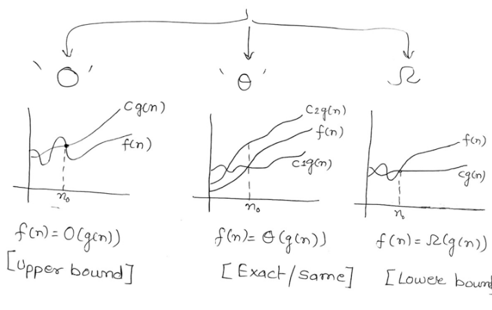
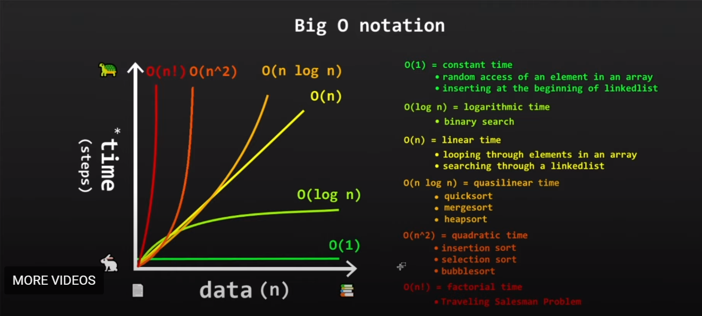
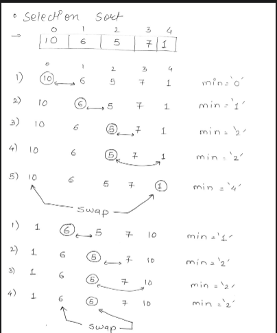
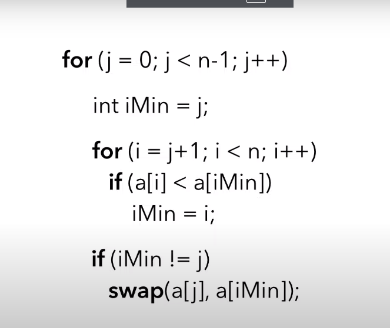
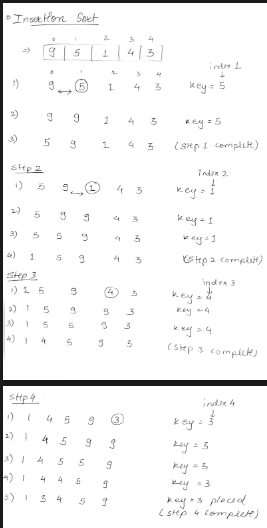
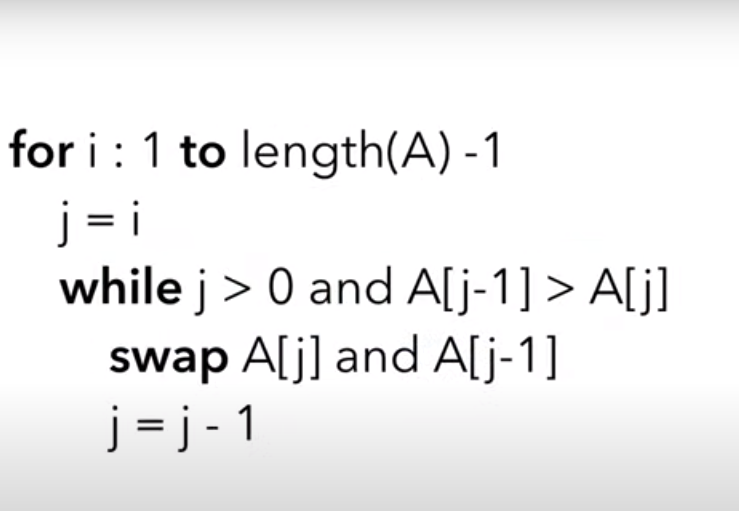
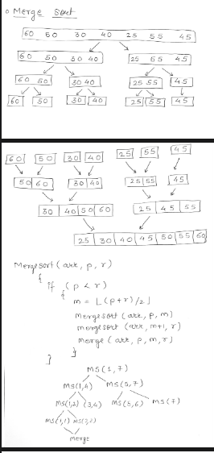
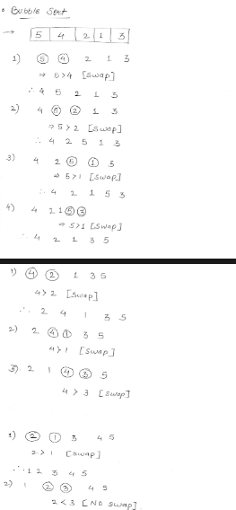
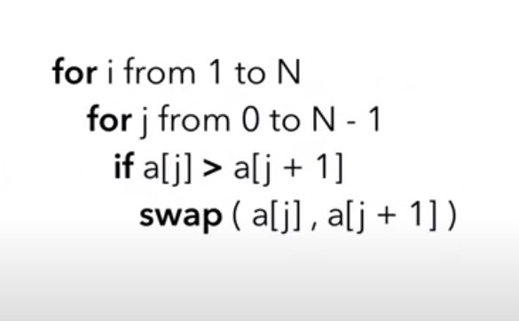
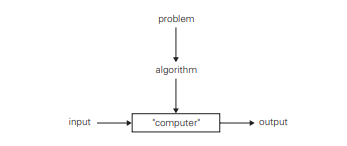

1. Breifly explain asymptomatic notations with expressions
    > Asymptomatic notations which are also known as asymptotic analysis , are the fundamental concep in computer science  and it describes the behaviour of algorithms  and data structure as the input size  approaches infinity and these notations provide a way to quantify the efficiency and scalability of algorithms, allowing us to compare and nalyze their performance by their rank and order of growth.
    There are mainly three types of notations 
    - O (big oh)
    -  (big omega)
    -  (big theta)
    
    
2. Explain selection sort   algorithm with a suitable example
    > In selection sort  it scans the entire given list to find the smallest element and exchange it with the first element of unsorted portion repeat these two steps  until the entire array is sorted (this is the case for sorting in ascending order incase of descending order the smallest element should be exchanged with the element in the right of unsorted array) - Selection sort has time complexity of O(n^2) this means as the size of the input increases the time required to sort will increase quadratically.

    
    
3. Explain insertion sort   algorithm with a suitable example
    > Insertion sort works by building  a sorted sub array within the larger array , the algorithm  starts by considering the first elementof the array as the sorted subarray , and then it proceeds to insert eh remaing elements one by one into their correct positions within the sorted subarray. repeats this steps until the array is sorted 

    
    
4. Explain Travelling salesman problem?
5. Explain merge sort algorithms with suitable example .
 >Merge sort is a divide and conquer algorithm that recursively divides the input array into smaller subarrays until they are small enough to sort, and then merges thse sorted subarrays back together to form the final sorted array

6. Explain Brute force string matching method with an example.
7. Explain Bubble sort algorithm with an example 
    >Bubble sort is a simple sorting algorithm that repeatedly steps through the list and compares the adjacent elements and swaps them if they are in wrong order , then they move on to the next par of elements and swaps if they are in wrong order  and repeat all the steps until the array is sorted 

    
    
8. Explain what is Algorithm
    > An algorithm is a sequence of unambiguous instructions for solving a problem that is for obtaininga required output for any legitimate or particular input ina finite amount of time 
    
 
- Algorithmsm can be specified in a natural language or pseudocode they can also be implemented as computer programs .
- The nonambiguity requirement for each step of an algorithm can't be compromised.
- the range of inputs in each step for an algorithm should be defined carefully
- one algorithm can be represented in several different ways 
- similarly to solve one problem there may exist several algorithms 
- different algorithms can solve a single problem with different speeds accordingly.

