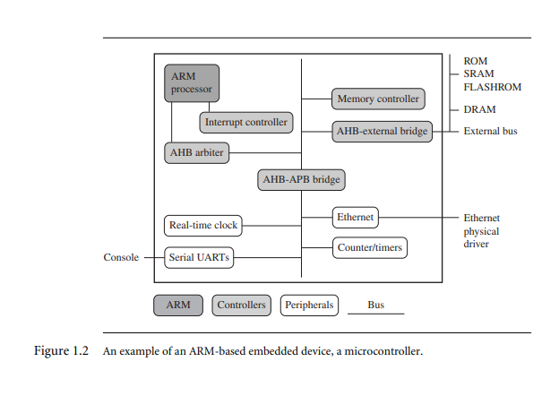

1. Difference between Microprocessor and Microcontrollers
   1. **Microprocessors (µP):**
      - A microprocessor consists of only a **Central Processing Unit (CPU)**.
      - It is commonly used in **personal computers** (PCs) and other general-purpose computing devices.
      - Microprocessors require **external components** such as memory (ROM, RAM), input/output (I/O) interfaces, and peripherals to function.
      - They are designed for applications that require **intensive processing power** and flexibility.

   2. **Microcontrollers (µC):**
      - A microcontroller integrates several components onto a **single chip**:
      - **CPU**
      - **Memory (ROM and RAM)**
      - **I/O ports** for connecting peripherals
      - **Timers** for precise timing control
      - Microcontrollers are like **mini-computers** with everything needed for a specific task on a single chip.
      - They are commonly used in **embedded systems**, such as home appliances, automotive control systems, and industrial automation.
      - Microcontrollers are optimized for **specific tasks** and do not require complex operating systems or external components.

2. Explain RISC philosophy with 4 major rules.
   - RISC (Reduced Instruction Set Computer ) it helps in delivering simple but powerful instructions  that execute withing a single cycle at high clock speed.
   - It concentrates on reducing the complexity of instructions performed by the hardware 
   - RISC places greater demands on compiler  whereas the traditional CISC relies more on the hardware for instruction functionality and they are even more complicated 
   
   >The four major rules for design of RISC.
      1. Instructions: RISC processors have reduced number of instruction classes. and all these instructions provide simple operations which can be executed in single clock cycle.
      - The compiler synthesises the complicated operations by combining several simple instructions.
      - Each instruction is of fixed length so that the pipline can fetch the future instructions

      2. Pipelines : The processing of instructions is broken down into smaler units that can be executed in parallel by pipelines and these pipelines advances by one step for maximum throughput
      - Instructions can be decoded in pipeline stage and need not be executed bya miniprogram called microcode as on CISC processors

      3. Registers: RISC have large general purpose registers and these can contain either datea or address.
      - Registers act as fast local memory store for all data processing operations whereas in CISC there are dedicated registers for specific purpose.

      4. Load Store Architecture: The processor operates on the dat held in registers. 
      - These seperate LS instructions transfered between the register and external memory.
      - Can use the data held in register bank  multiple times without needing multiple memory access. as Memory acces is costly.
3. Explain architecture of ARM Embedded Device with neat diagram
   
   - ARM Processor : controlles the embedded device , it compirses of a core(the execution engine that processes instructions and data) and the surrounding component s that communicate with the bus 
   - Controllers: important functional blocks they are Interrupt and Memory controllers
   - Periperals : provide the i/o capability 
   - Bus : used for communication between different pars of the device.

4. Difference between RISC and CISC
   

5. Explain in detail about CPSR 
   CPSR is used by ARM core to monitor and control the internal operations 
   - It is a dedicated 32 bit register which resides in the register file .
   
   - It is divided into four field  each of 8 bits wide : flags, status , contol and extension
   Extension and status field : reserved for future use.
   Control field : contains the processor mode, state and interrupt mask bits
   Flags field: contains the condition flags.