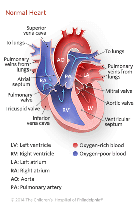

1. Define cell explian with neat diagram
    >The cell is the fundamental unit of life . It is the basic structural, functional and biological unit of all living organisms. Cells are often refered as building blocks of life  as they are the smallest units that can independently replicate and perform the essential functions necessary for life

     
    
2. Explian properties and functions of carbohydrates, protein, nucleic acid and lipids
    1. Carbohydrates and Lipids :
        -  consist primarily of atoms of C,H and O in the ratio of 1:2:1 and both server as major  sources of energy in body
        - Carbohydrates consist of simple sugars - monsaccharides, disaccharids and polysaccharides (such as glycogen)
        - Lipids : are insoluble in polar solvents such as water  because lipids consists  primarily of Hydrocarbon chains and rings, which are non polar and  there fore hydrophobic 
    2. Proteins :
        - Proteins are large molecules composed of amino acid sub-units . There are about 20 different types of amino acid that can by used in constructing a given  because they are so diverse structurally proteins serve in wide variety of functions than any other type of molecule like increasing muscle mass, bone mass , making hair and skin healthy. etc 
    3. Nucleic Acids :
        -Nucleic acids include the macromolecules like DNA and RNA which are critically important in genetic regulation and subunits  from which these molecules are formed these nucleotides 
        1. DNA is composed of four nucleotides each of dioxyribose.
            - two bases are *purines adenine and guanine* ; two others contain *pyrimidines sytosine and thymine*.
            - H bonds can only be formed between the bases adenine and thymine and between the bases of guanine and cytosine.
            - This complementary structure of DNA is necessary for genetic expression.
        2. RNA conists of four nucleotides each of which contains the sugar ribose
            - nucleotide bases are adenine , guanine ,cytosine and uracil(in place of DNA its thymine.)
            - there are different types of RNA, which have different functions in genetic expression

3. Explain the role of nucleic acicd in DNA vaccination for rabies and  RNA for COVID 19
    1. DNA Vaccine for rabies:
        - The DNA vaccine for rabies is a type of vaccine that uses a piece of rabies virus DNA to stimulate an immune response against the virus.
        - The vaccine works by introducing the rabies vius DNA into the body where it is taken up by cell to produce viral proteis and are displayed onthe surface of the cells which triggers an immune response and producetion of  antibodies against the rabies virus
        - Advantages:
            - Efficiency:highly effective in preventing rabies in both human and animal 
            - Long lasting protection 
            - Ease of administration: as they can be given via injection or even delivered orally which can be particularly useful in areas where the access to medical facilities is limited.
            - Reduced risk of side effects: as they don't contain live virus particles 
    2. RNA vaccines :
        - RNA vaccines are type of vaccine that use genetic material froma pathogen in the form of RNA to stimulate an immune response against the diesease.
        - The vaccine works by introducing the pathogens' RNA into the body where it is taken up by the cells and are used to produce viral or bacterial proteins.these are then displayed in the surface which triggers the immune response and the production of antibodies against the pathogen
        - Advantages:
            - faster production time 
            - ability to target multiple antigens 
            - High efficiency
            - Easy to omodify :  if a new variant emerges that is resistant to the existing vaccines it is posible to quickly modify it 
            - Safe : as they don't contain any live virus particles .
            - broader usage : influenza ,zika HIV etc

4. What is the difference between DHA and PLA as bioplastic
    - 
5. Explain DNA fingerprinting.
    >DNA fingerprinting is also called as DNA profiling or genetic fingerprinting . is a techinque use in forensic science into identify and individual based on their unique DNA profile . THe process inovles  analyzing the specific regionsof an individual's DNA, called markers, which can vary from person to person

    - The process of DNA fingerprinting typically involves the following steps :
        1. Extracting DNA from a sample such as blood , hair, or saliva.
        2. Cutting DNA into fragments using restriction enzymes.
        3. Seperating the DNA fragments by using gel electrophoresis
        4. Transfering the fragments on to a membrane
        5. Hybridizing the fragments
        6. Visualizing the hybridized fragments using autodiography or flouroscence detection resulting in a unique barcode for each individual
6. Explain heart with a neat sketch
    
    
    Based on the search results provided, here are the key steps in how the human heart works:

## Steps of How the Human Heart Works

1. **Blood Enters the Right Atrium**: Deoxygenated blood from the body enters the right atrium of the heart.

2. **Blood Flows to the Right Ventricle**: The right atrium pumps the deoxygenated blood into the right ventricle.

3. **Blood Pumped to the Lungs**: The right ventricle then pumps the deoxygenated blood to the lungs through the pulmonary artery. 

4. **Blood Oxygenated in the Lungs**: In the lungs, the blood picks up oxygen and gets rid of carbon dioxide.

5. **Oxygenated Blood Enters the Left Atrium**: The oxygenated blood returns from the lungs to the left atrium of the heart.

6. **Blood Flows to the Left Ventricle**: The left atrium pumps the oxygenated blood into the left ventricle.

7. **Blood Pumped to the Body**: The powerful left ventricle then pumps the oxygen-rich blood out to the body through the aorta.

8. **Blood Circulates Through the Body**: The blood travels through the arteries, capillaries, and veins to deliver oxygen and nutrients to all the body's tissues.

9. **Deoxygenated Blood Returns to the Heart**: The deoxygenated blood from the body's tissues returns to the right atrium, completing the cycle.

