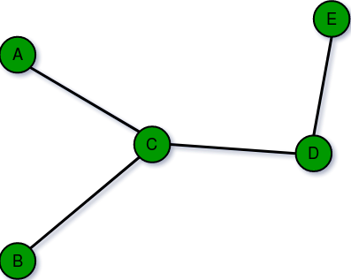
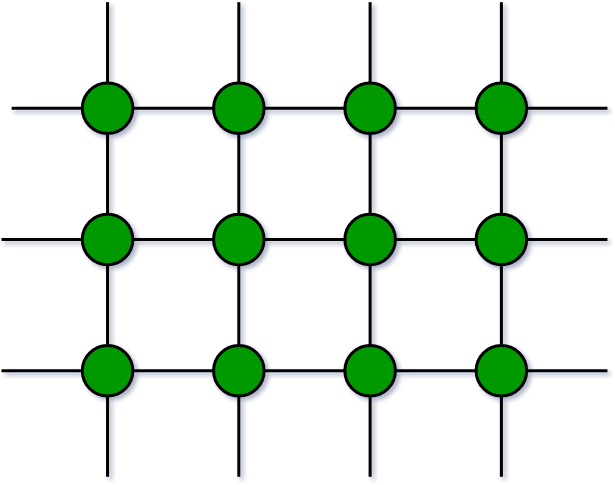
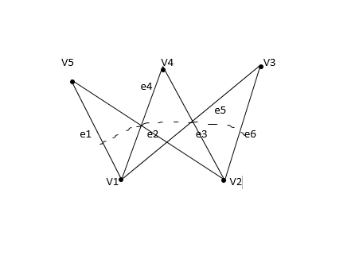
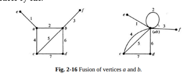

1. Explain graph and its types.
    >Graphs are fundamental data structure in Computer Science used to model relationships between objects A graph contains set of objects V={v1,v2.... } called vertices and E={e1,e2 ,....}
    - Types of graphs
        1. Undirected and Directed graphs
        2. Weighted and Unweighted graphs (each edge have numberical value which is called weight and represents the cost/strength)
        3. Complete Graph : undirected graph where every vertex is connected to every other vertex  in n vertices there are n(n-1)/2 edges.
        4. Bipartite graphs : undirected graph where the vertices can be divided into two disjoint sets such that every edge connects a vertex from one set to a vertex from other set 
2. Explain finite , infinite and bipartite graphs with example.
    - Finite Graph:
        A finite graph is a graph where number of vertices and edges  of the graphs are limited and countable
        
    - Infinite graph :
         is a graph with a infinite number of vertices and edges  consists of an uncountable number of vertices  or edges denoted by V and E respectively.
         
    - Bipartite Graphs: 
        These are the graph werhe the vertices can be diviede into two disjoint sets such that very edge connects a vertex from the set to a vertex from other set 
        
3. What is digraph and explain its types.
    >Digraph is the short form of directed graph this is a type of graph where the edges have a specific direction meaning that the relationshp between two vertices is asymmetric
    - Types of Digraphs
        1. Simple Digraph: A digraph with no self loop or parallel edges 
        2. Asymmetric Diagraph : that have at mose one directed edge between a pair of vertices but are allowed to have self loops
        3. Symmetric Digraph : in which every edge a,b is also b,a.
        4. Complete Digraph : 1. Complete Symmetric and 2. Complete Asymmetric Digraphs.

4. What is pendent vertex and self loops ?
    >A pendent vertex is a vertex that has only one edge connected  to it . It is the vertex that is connected to the rest of the graph by a single edge 
       A---B
       |   |
       C---D
    >A self loop is an edge that connects a vertex to itself . In other words  it is an edge that has both endpoints at the same vertex 
5. Explain Euler graph and Euler path 
    - Euler Path
        is a path in a graph that visits each edge exactly once . If such a path exists the graph is called semi-Euleran 
        - a necessary condition for the existence of euler path is that zero or two vertices have odd degree and all other vertices have even degree if there is no vertices with odd degree then all euler paths are circuits
        - Euler graph is a connected graph where g every vertex has even degree while an Euler path is a path that visits each edge exactly once  .
6. Explain different types of operation in the graph 
    1. Union: is a graph that contains all the vertices nd edges from both G1 and G2 
    2. Intersection: Vertices and edges that are common from the both
    3. Sum of graph : graph consisting of the vertex set V1 U V2 and of edges that are either  in G1 or G2 but not in both 
    4. Deletion: The deletion of a vertex or edge from a graph G is an  operation  that removes the specified vertex or edge from the grap resulting in a new graph G'.
    5. Fusion: created by identifying (merging) a subset of vertices from G1 witha subset of vertices from G2. Fusion is more general operation that union as it allows merging of vertices whic can result in the creation of new edges 
     
7. Explain isomorphic and subgraph.
    >Isomorphic Graphs : have the same structure , even though they may have different vertex labels or visual representations . They can be transformed into each other by relabeling the vertices and rearranging the edges.
    - They have the following properties:
        - same number of vertices and edges.
        - same degree sequences 
        - same number of connected components.
        - same number of cycle of each length
    >Subgraph: A graph g is said to be a subgraph of a graph G if all the vertices and al the edges of g are inseide G.
    - They have the following properties.
        - Every graph is its own subgraph.
        - A single vertex in a grap G is a subgraph of G.
        - A single edge in G , together with its end vetices. is also a subgraph of G
    
8. What is incident degree of undirected graph.
    - In undirected graph  the degree of vertex is number of edges incident to that vertex. The term "incident" means that  an edge is connected to a vertex at one of its end point
    - More formally  let G=(v,e ) be an undirected graph, where V is the set of vertices and E is the set of edges . for a vertex v1 which belongs to V the degree of v1 is denoted by deg(v) is the number of edges incident to the v1 
    - Applications:
        1. Regular graphs
        2. Edge deletion
        3. Vertex deletion