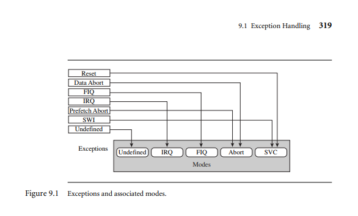

<!-- MODULE 2 -->
## 3. a. Explain different arithmetic instructions in ARM processor with example
- ADC: to add two 32 bit values and carry. Rd=Rn+N+carry
    ```ADC r0, r1, r2  ; r0 = r1 + r2 + Carry```
- ADD: add two 32 bit values; Rd= Rn+N
    ```ADD r0, r1, r2  ; r0 = r1 + r2```
- RSB: reverse subtract of two  32 bit values; Rd=N-Rn
    ```RSB r2, r5, #0xFF00 ; r2 = 0xFF00 - r5```
- RSC: reverse subtract with carry of two 32 values; Rd=N-Rn-!(carry flag)
    ```RSC r2, r5, #0xFF00 ; r2 = 0xFF00 - r5 - NOT(Carry)```
- SBC: reverse with carry of two 32 values; Rd=Rn-N-!(carry flag)
    ```SBC r0, r1, r2  ; r0 = r1 - r2 - NOT(Carry)```
- SUB: subtract two 32 bit values; Rd= Rn-N
    ```SUB r5, r3, #10 ; r5 = r3 - 10```
## 3. b. Explain single register load store addressing mode syntax , table, index mode with an example.
- 1. Single register load/store addressing mode
    - In assembly language and computer architecture the single register load/store addressing mode is a way to access to memory using a single register to hold the address
    - LOAD: move data from memory into a register.
    - STORE: move data from a register into a memory
    - Syntax: LOAD[STORE,DESTINATION,[REGISTER]]

- 2. Table Addressing
- LDR---load word into a register----Rd<---mem32(address)
- STR---save byte or word from a register---Rd->mem
- LDRB--- load byte into a register---(8 address)
- STRB---Save byte from a register-- 8(address)
- LDRH --- load halfword into a register -- 16 address
- STRH --- SAVE halfword into a register
- LDRSH --loda signed halfword into register

- 3. Index Mode
    - Index mode is used to access memory locations with an offset , typically using a base register and an index register it's similar to table addressing mode but might not include the scale factor Ex: LOAD r3,[r1+r2] here r1 is the base address of the array  and r2 is the index.


## 4. a. Explain barrel shifter instructions in ARM with suitable examples.
- The ARM architecture includes a barrel shifter , which  is  a hardware component that can effeciently perform various bitwise shifting and rotatin operations on data. The barrel shifter can be used in conjuction with many ARM instructions , providing a powerful and flexible wawy to manipulate operands
1. Logical Shift Left (LSL): shifts the bits of the input to the left by the specified number of bits. zeroes are shifted into the least significant bits and bits  shifted out from the most significant end are discarded.
    - Example: ```ADD RO,R1,R2 LSL #3 -- this results in RO=R1+(R2<<3)```
2. Logical Shift Right(LSR): shifts the bits of the input to the right  by the specified number of bits  . zeros are shifted into the most significant bits and bits shifted out from the least significant end are discarded.
    - Example ```MOV R0, R1, LSR #4 results in R0 = R1 >> 4```
3. Arithmetic Shift Right (ASR): similar to LSR, but it preserves the sign bit  during the shift , effectively performing a sign extending right shift .
    - Example: ``` MOV RO, R1, ASR #4``` --- this results in R0 = R1 >>4
4. Rotate Right (ROR): Rotates the bits of the input to the right by the specified number of bits. Bits shifted out from one end are shifted back in from the opposite end
    - Example: ```MOV R0, R1, ROR #8 results in R0 = (R1 >> 8) | (R1 << 24).```
5. Rotate RIght with Extend : Similar to ROR but with an additional carry bit shifted in from the carry flag. 
    - Example: ```MOV R0, R1, RRX results in R0 = (Carry << 31) | (R1 >> 1```
## 4. b. Explain logical instruction in ARM prpocessor with an example 
- ARM processors include several logical isntructions that perform bitwise operations on the data . Here are the primary logical instructions with examples.
    1. AND: performs bitwise AND operation; AND Rd,Rn,op2
    2. ORR: performs a bitwise  OR operation.;ORR,Rd,Rn op2
    3. EOR: performs Exclusive OR operation ; EOR Rd, Rn, op2;
    4. BIC: clears specific bits by performing a bitwise AND with the NOT of the second operand.; BIC Rd,Rn,op2
<!-- -----MODULE 3------- -->
## 5. a. Explain code optimization, profiling and cycle counting
- Code Optimization , profiling and cycle counting are essential techniques in software development, particular for performance-critical applications
1. Code Optimization: involves modifying a program to improve its performance , reduce resource consumption or enhance mainatinability, these includes:
    - Loop optimization: reducing the overhead of loops, such as using decrementing loops instead of incrementing ones, which can lead to more efficient assembly code.
    - Compiler Optimization Levels: compilers offer various optimization levels like -00 to -03 that balance between debugging ease and performance. Higher levels may imporve speed but complicate debugging.
2. Profiling: is the process of analyzing a program to identify performance bottlenecks. This innvolves measuring the time spent in various functions or code segments, which helps developers focus optimization efforts where they are most needed. Tools like gprof or ARM's DS-5 can be used for profiling , providing insights into function call frequencies and execution times.

3. Cycle counting: refers to measuring the number of clock cycles consumed by specific instructions or code segments. This metric helps developers understand the efficiency of their code on a given architecture. by analyzing cycle counts , one can identify high cost operations and optimize them, ensuring that the software runs efficiently on hardware with limited resources.
## 5. b. Write a C program that prints the square of the integers between 0 to 9 using fuctionand explain how to convert this C function to an assembly function  in command.
```
    #include <stdio.h>

// Function to calculate the square of a number
int square(int num) {
    return num * num;
}

int main() {
    for (int i = 0; i < 10; i++) {
        printf("Square of %d is %d\n", i, square(i));
    }
    return 0;
}
```
- Converting the C function to assembly:
    - To convert the square function to assemby language an compiler option is used to generate the assembly output. For example using gcc code with -s
    - ``` gcc -S -o square.s square.c```
## 6. a. Discuss how registers  are allocated to optimize the program.
- Register Allocation is a crucial aspect of optimizing programs in microcontrollers. particularly due to their limited resources. Effective register management enhances performance by minimizing memory access and maximizing the use of fast registers.
#### Key concepts in register allocation:
    1. Register assignment: the compiler assigns variables to registers based on their usage frequency. Variables that are accessed frequently, such as loop counters etc.
    2. Spilling: when the number of variables exceeds available registers, some variables are spilled to memory. this involves storeing them on stack, which is slower to access . the goal is to minimize spilling 
    3. Coalescing: this techinique eliminates unnecesary move instructions by assigning the same register to different variables when their  lifetimes don't overlap this increases their execution speed 
    4. Lifetime Analysis: the compiler analyses the lifetime of the variables in the registers so that it can be safely removed from a register
    5. Calling conventions: The ARM architecture procedure calling standar defines how registers are use dduring funtion calls specifying which registers must by preserved and which can be used freely.

## 6. b. Develop an ALP to find the sum of first 10 integer numbers.
```
    .data
    result:
        .word 0
    .text
    .global _start

    _start:
        MOV R0, #1 // initializes counter to 1
        LDR R1, =result //load address of result variable
        MOV R2,#0 // initializes sum to 0
    
    loop:
        ADD R2,R2,R0 // ADD CURRENT NUMBER TO SUM
        ADD R0,R0, #1  //INCREMENT COUNTER
        CMP R0, #11   //CHECKS IF COUNTER IS EQUAL TO 11
        BNE loop   // if not equal, jump to loop

        STR R2,[R1]    // STORE FINAL SUM IN RESULT VARIABLE
        B end // branch  to end of program.

    end:
        SWI 0x11  // exit program

```
- Explanation:
    1. The program starts by declaring a .data section with a label result to store the final sum
    2. The .text section contains the executable code, starting with _start label.
    3. In the _start label:
        - MOV R0,R1 intitializes the counter register R0 to 1.
        - LDR R1 =result loads the address of the result variable into R1.
        - MOV R2, #0 intitializes the sum register R2 to 0.
    4. The loop label represents the start of the loop:
        - ADD R2,R2,R0 adds the current number R0 to the sum R2.
        - ADD R0, RO, #1 increments the counter (R0) by 1.
        - CMP R0, #11 compares the counter with 11 (since we want to sum the numbers from 1 to 10).
        - BNE loop branches back to the loop label if the counter is not equal to 11 (i.e., the loop condition is not met).
    5. After the loop, STR R2, [R1] stores the final sum in the result variable
    7. The end label contains SWI 0x11, which is a software interrupt to exit the program.
<!-- MODULE 4 -->
## 7. a. Write a neat diagram explain ARM processor exceptions and modes.
- 
- The ARM processor has the following exceptions :
    1. Reset --- SVC mode
    2. Undefined Instruction ---undefined mode
    3. SWI --- SVC mode
    4. Prefetch abort --- abort mode
    5. Data Abort --abort
    6. IRQ  --IRQ
    7. FIQ  -- IRQ
    - ARM exception vector table: is located at the bottom of the memory map , each entry in the table is a branch instruction or a load PC instruction that jumps to the actual exception handler.
- The ARM processor modes :
    1. User mode :normal program execution
    2. FIQ mode: handles fast interrupts
    3. IRQ:handles standard interrupts
    4. Supervisor Mode: handles software interrupts and aborts
    5. Abort Mode : handles memory access violations
    6. Undefied: handles undefined instructions
    7. System: privileged operating system mode.
## 7. b. Explain assigning interrups and interrupt latency. 
- Assigning Interrupts: are signals that inform the processor that an event needs immediate attention. they can be generated  by hardware devices like (times,i/o etc) or by software interrupts. In ARM systems, interrupts are categorized mainly into two types:
    1. IRQ: A standard interrupt that can be used by various devices.
    2. FIQ: A high priority interrupt designed for time sensitive tasks, allowing quicker response times
    - when assigning interrupts, the system considers:
        1. Priority levels
        2. Interrupt Vector table
- Interrupt Latency: refers to the time taken from the moment an interrupt is generated to the time the corresponding interrupt handler begins execution. It is influnced by several factors.
    1. Processor state: if the processor is executing a critical section of code or servicing a higher-priority interrupt may be delayed.
    2. Interrupt Masking: interrupts can be temporarily disabled while critical tasks are being executed. This can increase latency if many interrupts occur during this period.
    3. Context Switching: when an interrupt occurs the processor must save the current context before executing the interrupt handler. This context switching adds to the latency
    4. Handler execution: the time taken to execute the interrupt handler itself contributes to the overall latency.


